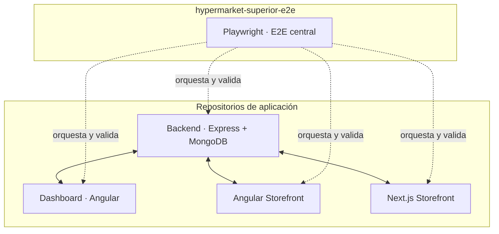
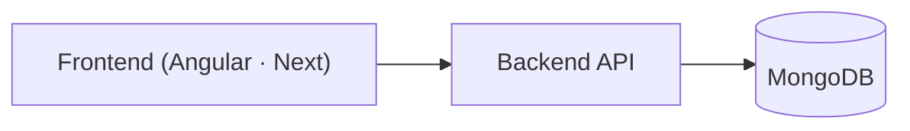
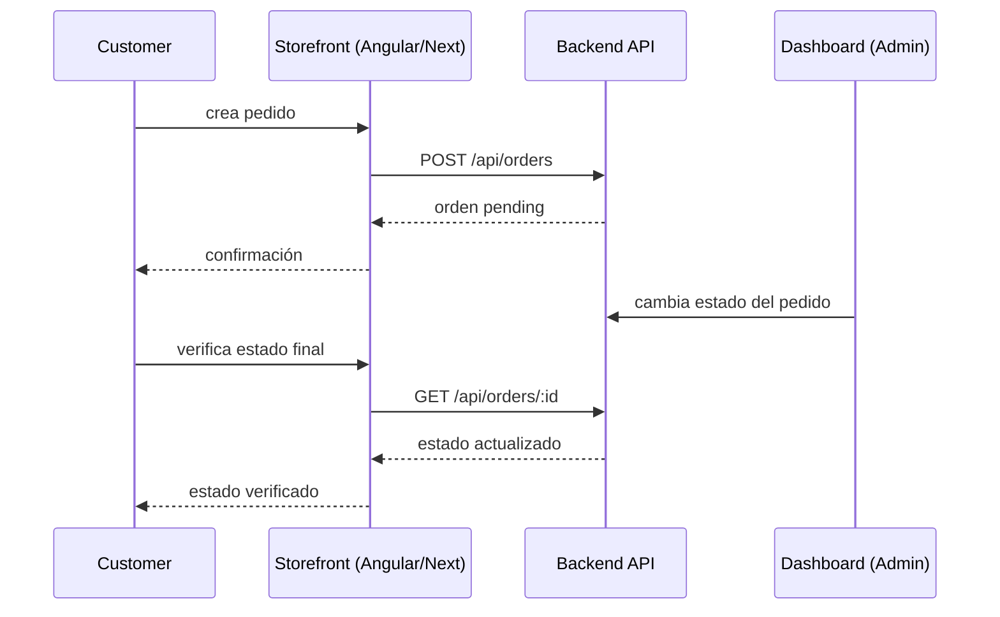

# hypermarket-superior-e2e — Harness E2E central del Hipermercado Superior

Suite **Playwright** que orquesta los **4 repositorios de aplicación** del
ecosistema **Hipermercado Superior** con un único `playwright.config.ts`.

> Es **infraestructura de validación End-to-End**, no una aplicación de negocio
> ni un servicio de runtime. No contiene lógica de negocio y **no reemplaza** los
> unit ni integration tests de cada aplicación.

Existe como repositorio independiente para centralizar fixtures, helpers,
configuración y specs E2E; orquestar y validar varios repositorios a la vez;
probar flujos cross-app; y validar interacciones entre frontends, backend,
autenticación, persistencia y dashboard cuando el escenario lo requiere.

## Ecosistema



| Repo | Tipo | Tecnología | Rol |
|---|---|---|---|
| backend-advanced-websites-hypermarket-express-mongodb | Backend API | Express + MongoDB + JWT | API central del sistema |
| dashboard-websites-hypermarket | Admin Frontend | Angular | Panel administrativo |
| pre-advanced-websites-hypermarket-angular | Customer Frontend | Angular | Tienda pública alternativa |
| pre-advanced-websites-hypermarket-next | Customer Frontend | Next.js | Tienda pública |
| hypermarket-superior-e2e | E2E Harness | Playwright | Validación End-to-End central |

Flujo de datos que valida:



Flujo cross-app (un escenario real cubierto por los specs):



## Responsabilidades

**Pertenece al harness:**

- Configuración de Playwright (`playwright.config.ts`)
- Fixtures (`fixtures/`)
- Helpers y API helpers (`helpers/`)
- Datos de test y generadores (`helpers/data.ts`)
- Estado de autenticación / storageStates (`auth/`)
- Specs E2E (`specs/`)
- Orquestación de los repositorios (webServer)
- Artefactos de test (traces, screenshots, videos, reportes)

**NO pertenece al harness:**

- Lógica de negocio
- Componentes de frontend
- Servicios del backend
- Infraestructura de producción
- Runtime de las aplicaciones

## Arquitectura del harness

```
hypermarket-superior-e2e/
├── auth/
│   └── setup/auth.setup.ts   # Genera los storageStates (proyecto `setup`)
├── config/
│   └── env.ts                # Fuente única: puertos, repos, credenciales seed, URIs de aislamiento
├── fixtures/
│   └── base.ts               # uniqueEmail (test) + adminApi (worker-scoped)
├── helpers/
│   ├── admin-api.ts          # Verificación del estado de negocio vía admin API
│   ├── data.ts               # Datos estables del seed + generadores únicos
│   └── ui.ts                 # Utilidades de UI (clearLocalCartMirror)
├── specs/
│   ├── angular/              # checkout E3-A, admin E3, contact E4.5, smoke
│   ├── next/                 # checkout E3-N + E3-Integration, smoke
│   └── dashboard/            # smoke
├── global-setup.ts           # Gate de aislamiento + clear:seed E2E
├── global-teardown.ts
├── playwright.config.ts
├── package.json
├── tsconfig.json
└── README.md
```

Los `auth/*.json` (storageStates) y los artefactos de test (`test-results/`,
`playwright-report/`, `.tmp/`) están gitignoreados.

## Proyectos Playwright

| Proyecto | Qué prueba | Puerto |
|---|---|---|
| `setup` | Genera los storageStates (admin dashboard, customer angular, customer next) | — |
| `angular-storefront` | Specs del storefront Angular (`specs/angular/`) | 4200 |
| `next-storefront` | Specs del storefront Next (`specs/next/`) | 3001 |
| `dashboard` | Specs del dashboard (`specs/dashboard/`) | 4201 |

Los proyectos de aplicación dependen de `setup`. `workers: 1` para estabilidad
sobre la BD E2E compartida.

## Orquestación

Playwright levanta las aplicaciones vía `webServer` con un solo comando:

| Servicio | Puerto | Detalle |
|---|---|---|
| Backend (Express + MongoDB) | 3000 | Arrancado **siempre** por Playwright con env E2E (`npm run dev`, cwd del backend). **No** usa `reuseExistingServer`: si hay otro proceso en :3000, falla a propósito (señal de un backend de dev vivo). |
| Angular Storefront | 4200 | `npm start` · `reuseExistingServer: true` |
| Next.js Storefront | 3001 | `npm run dev` (con limpieza previa de `.next`) · `reuseExistingServer: true` |
| Dashboard | 4201 | `npx ng serve --port 4201` · `reuseExistingServer: true` |
| MongoDB | 27017 | Requerido por el backend E2E (`mongodb://127.0.0.1:27017/hypermarket_e2e`) |

El Dashboard corre en **4201** durante E2E para no chocar con el storefront
Angular (4200). La estrategia definitiva de infraestructura para CI todavía no
está decidida; el `webServer` no debe leerse como la solución final de CI.

## Aislamiento

- El `global-setup` ejecuta el **`clear:seed` real del backend** contra la BD
  `hypermarket_e2e`. **Gate de protección:** aborta si la URI no contiene
  `hypermarket_e2e` — la BD de desarrollo nunca se toca.
- Storage de imágenes E2E: `STORAGE_LOCAL_DIR=.tmp/e2e-storage`, separado del
  storage de desarrollo (`storage/`).
- `NODE_ENV=test` desactiva los rate-limits globales del backend durante E2E
  (el limiter de **login** 10/15min por IP permanece activo).
- Datos reproducibles: `clear:seed` idempotente → estado conocido (8 categorías,
  184 productos, 7 ofertas, inventario stock 100, 3 usuarios seed).
- No se modifica ningún archivo de los 4 repos de aplicación.

## Autenticación

- El proyecto `setup` realiza el login **por UI** una vez y guarda los
  storageStates (`auth/*.json`, gitignoreados):
  - `admin.dashboard.json` → JWT en `localStorage['hs.auth-token']` (dashboard)
  - `customer.angular.json` → cookie httpOnly `hypermarket_auth` (Angular)
  - `customer.next.json` → cookie httpOnly `hypermarket_auth` (Next)
- Los specs reutilizan esas sesiones (no rehacen login) y cada contexto está
  aislado por aplicación.
- `adminApi` (fixture worker-scoped) hace **un único** login de admin por
  corrida para no exceder el rate-limit de login del backend.
- Usuarios seed por rol (admin y customer) definidos en `config/env.ts`; no hay
  secretos reales en el repositorio.

## Estrategia de testing

```
Unit
  ↓
Integration / API
  ↓
E2E (este repositorio)
```

Playwright **no reemplaza** los unit ni integration tests: cada aplicación
conserva los suyos (Jest, Vitest, etc.). El E2E valida:

- flujos críticos del negocio (compra → pago → cancelación);
- comportamiento observable en la UI;
- integración entre aplicaciones (storefront ↔ backend ↔ dashboard);
- autenticación y autorización;
- interacción frontend/backend;
- estados finales importantes (orden, stock, movimientos, audit logs).

## Single-user y multi-user

El harness corre con un único worker, lo que permite escenarios deterministas
sobre la BD E2E compartida. Cuando el negocio lo requiere, se usan **múltiples
BrowserContexts** (customer + admin) en el mismo test, p. ej.:

```
Customer Storefront → crea pedido
Dashboard (Admin)   → cambia el estado del pedido
Customer Storefront → verifica el estado final
```

## API helpers

La API se usa para **preparar y verificar**, no para ejecutar el
comportamiento bajo test:

- preparar datos y crear precondiciones;
- limpiar estado (p. ej. carrito server);
- verificar estados finales (orden, stock, movimientos, audit, contactos).

Principio:

> **UI para ejecutar el comportamiento; API para preparar o verificar cuando aporta valor.**

`helpers/admin-api.ts` expone `adminLogin`, `assertAdminOrderState`,
`findInventory`, `getInventoryMovements`, `getAuditLogs`,
`ensureServerCartQuantity` y `getContacts`.

## Niveles / prioridad de tests

El repo define actualmente dos niveles de ejecución (no existen P0–P3):

- **`@smoke`** — tag aplicado a los specs de infraestructura (setup de auth y
  smoke por aplicación); verifica que el ecosistema arranca y responde.
- **Suite completa** — todos los specs (13 tests): checkout, admin, contact y
  smoke de los proyectos `angular-storefront`, `next-storefront` y `dashboard`.

## CI

CI/CD E2E **implementado** vía `.github/workflows/e2e.yml` (`workflow_dispatch` + `push`/`pull_request` en `main`).

* Levanta backend (`hypermarket_e2e` + `STORAGE_LOCAL_DIR=.tmp/e2e-storage`) + Angular `:4200` + Next `:3001` + Dashboard `:4201` + `MongoDB 7` y ejecuta `npx tsc --noEmit` + `npm run e2e` (17 tests, `workers:1`, `retries:2` en CI, `trace/screenshot/video retain-on-failure`).
* Para PRs de `superior-hypermarket-api`, `trigger-e2e.yml` dispara `workflow_dispatch` con `consumer_repo/head_sha` (`pull_request.head.sha`), valida `git rev-parse HEAD == head_sha` y publica **Commit Status** `e2e/17-tests` (`pending` → `success 17/17` / `failure`) vía GitHub App (`vars.E2E_APP_ID` / `secrets.E2E_APP_PRIVATE_KEY`).
* Branch Protection `main-protection` en `superior-hypermarket-api` requiere `e2e/17-tests` + `lint-test-build` `strict:true` + `1 approval` + `Block force pushes`.

Documentación técnica completa: `docs/ci-cd/e2e-quality-gate.md`.

## Comandos

```bash
npm install                       # instala @playwright/test
npx playwright install chromium   # descarga el navegador
npm run e2e:smoke                 # infraestructura: setup de auth + smoke por app
npm run e2e:angular               # solo specs del storefront Angular
npm run e2e:next                  # solo specs del storefront Next
npm run e2e:dashboard             # solo specs del dashboard
npm run e2e                       # suite completa
```

## Prerrequisitos

- Node.js ≥ 22
- MongoDB corriendo en `127.0.0.1:27017` (la BD de dev `hypermarket` NO se toca)
- Chromium: `npx playwright install chromium`
- **Detener cualquier backend de dev escuchando en :3000** antes de ejecutar la
  suite (Playwright fallará a propósito si el puerto está ocupado, para
  garantizar aislamiento).

## Verificación de paridad

Los specs migrados de los storefronts (`checkout`, `contact`, `admin`) conservan
las mismas assertions. Los E2E originales de cada storefront se eliminarán en
E9.6 tras confirmar cobertura equivalente.

## Deuda técnica conocida (bug N2 de carrito en los storefronts)

**Bug real de los storefronts (Next y Angular), no del harness.** La migración N2
escribe un espejo del carrito en `localStorage['carrito']` mientras el carrito
server no está sincronizado. Si un "Agregar" cae en esa ventana (race pre-`SYNC_OK`),
el item optimista se persiste al espejo mientras el server ya tiene ese item; el
siguiente `POST /api/cart/merge` **acumula cantidades** (`$inc` en el backend) →
`1+1=2`. La ventana es real pero estrecha (humano casi no la cruza; un clic
automatizado sí).

Pendiente en los repos (fuera del alcance del harness):
- `pre-advanced-websites-hypermarket-next/src/features/cart/CartContext.tsx`
- `pre-advanced-websites-hypermarket-angular/src/app/features/cart/services/cart.service.ts`
- `backend-advanced-websites-hypermarket-express-mongodb/src/modules/cart/services/cart.service.ts` (`mergeCart` suma) y
  `repositories/cart.repository.ts` (`applyAtomicInc` con `$inc`)

Fix propuesto: esperar `SYNC_OK` antes de permitir el add autenticado, o hacer
`mergeCart`/`addItem` con upsert absoluto (server-wins) en lugar de acumular.

**Mitigación E2E en el harness** (no oculta el defecto, documentado aquí):
`helpers/ui.ts` `clearLocalCartMirror` + `helpers/admin-api.ts`
`ensureServerCartQuantity` normalizan el carrito server a la cantidad exacta del
escenario justo antes de confirmar el pedido, para que la suite sea determinista.

## Defecto corregido (E9.3 P0.4): storefront Next crasheaba productos con imagen subida

**Bug real del storefront Next (ya corregido).** `specs/dashboard/product-publishing.spec.ts`
(P0.4) verifica de forma ESTRICTA que la imagen carga en ambos storefronts
(heading visible + `naturalWidth > 0` en Next, `src` + HTTP 200 en Angular).

Cadena del defecto (verificado reproduciendo la lógica exacta de `matchRemotePattern`):

- `backend-advanced-websites-hypermarket-express-mongodb/src/modules/products/presenters/product.presenter.ts`
  `cacheBust()` añade `?v=<updatedAt>` a la URL pública de toda imagen con `imageKey`.
- `pre-advanced-websites-hypermarket-next/next.config.ts` configuraba
  `images.remotePatterns: [new URL('http://localhost:3000/uploads/**')]`. Next
  normaliza el objeto URL a un RemotePattern destructuring `search` → queda
  `search: ''` (string vacío, no `undefined`).
- `next/image` `matchRemotePattern` exige `pattern.search === url.search` cuando
  `search !== undefined`; `'' !== '?v=...'` → no matchea → error E231
  ("hostname localhost is not configured") → la página entera cae en el error
  boundary ("Algo salió mal"); ni el heading del producto renderiza.

Impacto: **todo producto cuyo `imageKey` viniera del dashboard** (upload vía UI)
rompía la página `/product/:id` del storefront Next. Las imágenes seed (sin
`?v=`) sí renderizaban.

Fix aplicado (repo Next): `remotePatterns` con forma de objeto sin `search`,
declarados en `src/lib/image-remote-patterns.ts` (fuente única) e importados en
`next.config.ts`:
`{ protocol: 'http', hostname: 'localhost', port: '3000', pathname: '/uploads/**' }`
(idem para `127.0.0.1`). Regresión automatizada:
`src/lib/image-remote-patterns.test.ts` valida con `matchRemotePattern` real que
las URLs con `?v=` matchean y que hosts/puertos/rutas ajenos se rechazan.

Nota P0.4 (fase Angular): la imagen no puede cargarse cross-origin (`:4200` →
`:3000`) porque helmet del backend responde `Cross-Origin-Resource-Policy:
same-origin` (`net::ERR_BLOCKED_BY_RESPONSE.NotSameOrigin`); es un artefacto de
la topología dev (en prod el storefront es same-origin con el backend/CDN), por
lo que el spec verifica el `src` del `` y la servibilidad HTTP 200 del
archivo, no `naturalWidth`.

## Defecto corregido (E9.3, full-suite): login pre-hidratación en el storefront Next

Durante la revalidación del harness se detectó un fallo intermitente del
`specs/next/checkout.spec.ts` (E3-N): el click en "Iniciar sesión" podía ocurrir
antes de que React hidratara `LoginForm`, disparando un **submit nativo** (GET
`/es/login?`) que perdía el login en silencio; el helper usaba
`waitForURL("**/es**")`, un glob que también matchea `/es/login` y enmascaraba
el fallo (el test seguía anónimo y fallaba después en `/api/cart`).

Fix aplicado (repo Next): `LoginForm` deshabilita el botón submit hasta
completar la hidratación (`useIsHydrated` vía `useSyncExternalStore`, mismo
patrón que `useIsMobile`). Fix en el harness: `loginCustomer` ahora espera que
el botón esté habilitado y que el header autenticado ("Cerrar sesión") sea
visible — un login fallido falla el test en el paso exacto, sin enmascararse.